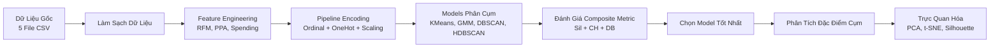
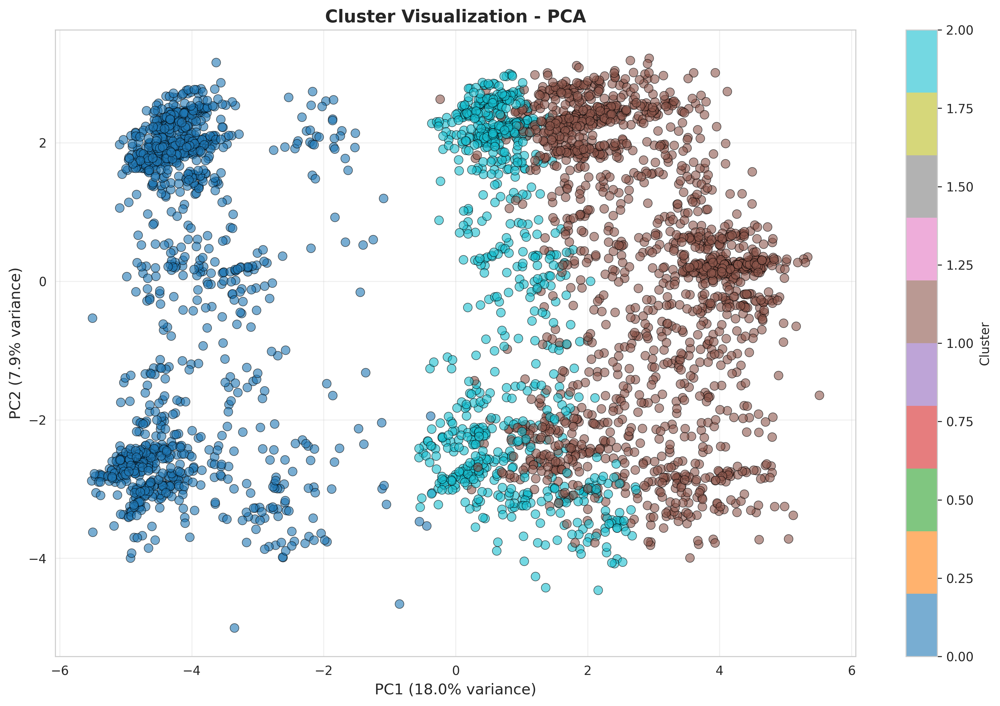
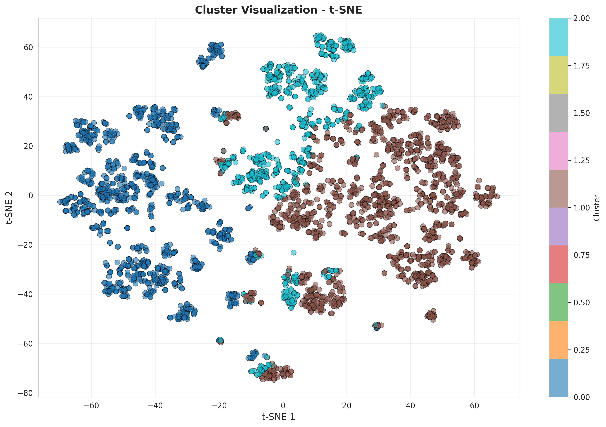
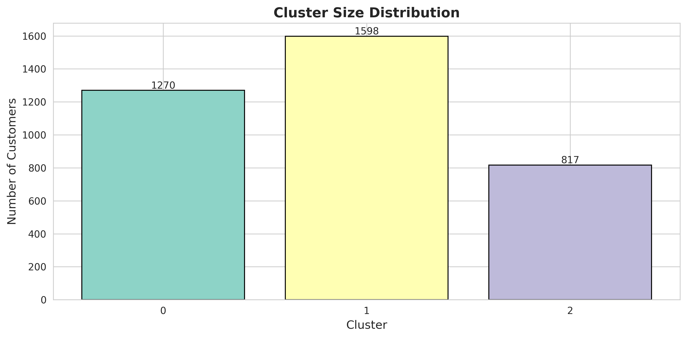

# ☕ Dự Án Phân Cụm Khách Hàng Highlands Coffee

<div align="center">


**Pipeline Machine Learning cho Phân Cụm & Phân Khúc Khách Hàng**

*Phân cụm khách hàng Highlands Coffee dựa trên hành vi tiêu dùng, nhân khẩu học và thái độ thương hiệu*

</div>

---

## Tổng Quan Dự Án

Dự án này xây dựng một **pipeline ML end-to-end** để phân cụm khách hàng Highlands Coffee, giúp:
- Nhận diện các nhóm khách hàng có đặc điểm tương đồng
- Tối ưu chiến lược marketing cho từng phân khúc
- Hiểu sâu về hành vi và sở thích khách hàng
- Tìm insights từ 3685 khách hàng với 58+ đặc trưng

### Tính Năng Chính
- **4 Thuật Toán Phân Cụm**: KMeans, GMM, DBSCAN, HDBSCAN - **Code tái sử dụng cho bất kỳ model nào**
- **4 Chế Độ Chọn Metric Linh Hoạt**: 
  - `"silhouette"` - Tối ưu theo Silhouette Score
  - `"calinski_harabasz"` - Tối ưu theo Calinski-Harabasz Index
  - `"davies_bouldin"` - Tối ưu theo Davies-Bouldin Index
  - `"composite"` - Cân bằng cả 3 metrics (mặc định)
- **Pipeline Tái Sử Dụng**: Chỉ cần thay đổi `model_type` và `metric_selection` trong config
- **Tự Động Tối Ưu Hyperparameter**: Grid search với 20-100+ cấu hình cho từng model
- **Trực Quan Hóa Tương Tác**: PCA, t-SNE, Silhouette Analysis
- **Hỗ Trợ Google Colab**: Train và visualize trực tiếp trên cloud

---

## 📂 Cấu Trúc Dự Án

```
coffee_project/
│
├── 📁 data/
│   ├── raw/                                    # File CSV gốc (5 datasets)
│   │   ├── 2017Segmentation3685case.csv        # Thông tin nhân khẩu học khách hàng
│   │   ├── Brandhealth.csv                     # Điểm nhận thức thương hiệu
│   │   ├── Brand_Image.csv                     # Đánh giá thuộc tính thương hiệu
│   │   ├── NeedstateDayDaypart.csv             # Hành vi tiêu dùng cà phê
│   │   └── SA#var.csv                          # Biến tâm lý khách hàng
│   │
│   └── processed/
│       ├── merged_full.csv                     # Dữ liệu đã merge 5 datasets (3685 dòng)
│       ├── feature_engineering_data.csv        # Dữ liệu sau feature engineering
│       ├── encoded_data.csv                    # Dữ liệu cuối cùng đã encode cho clustering
│       └── cleaned/                            # Các file đã làm sạch
│
├── 📁 src/
│   ├── preprocessing/
│   │   ├── data_loader.py                      # Load & merge 5 file CSV
│   │   ├── data_cleaner.py                     # Xử lý missing values, outliers
│   │   ├── feature_engineering.py              # Tạo features RFM, PPA, spending
│   │   └── encoder.py                          # Pipeline encoding (ordinal, one-hot, scaling)
│   │
│   ├── models/
│   │   ├── trainer.py                          # Train 1 model (KMeans/GMM/DBSCAN/HDBSCAN)
│   │   ├── tuning.py                           # Grid search hyperparameter + composite scoring
│   │   ├── evaluator.py                        # 3 metrics: Silhouette, CH, DB
│   │   └── save_load.py                        # Lưu/load model
│   │
│   └── config.py                               # Cấu hình toàn cục
│
├── 📁 notebooks/
│   ├── EDA.ipynb                               # Phân tích khám phá dữ liệu
│   ├── Run_Training_Colab.ipynb                # 🌟 Notebook training chính (Colab-ready)
│   └── Cluster_Visualization.ipynb             # Trực quan hóa & phân tích cụm
│
├── 📁 results/
│   ├── *_best.pkl                              # Models tốt nhất (KMeans, GMM, HDBSCAN)
│   ├── *_labels.csv                            # Kết quả gán nhãn cụm
│   ├── *_tuning.csv                            # Kết quả grid search
│   ├── cluster_profiling.csv                   # Đặc điểm từng cụm
│   └── *.png                                   # Hình ảnh trực quan (PCA, t-SNE, silhouette)
│
├── main.py                                     # Giao diện CLI (4 chế độ)
├── requirements.txt                            # Thư viện phụ thuộc
└── README.md                                   # File này
```

---

## 🔄 Pipeline Machine Learning



### Các Bước Trong Pipeline

#### 1️⃣ **Load & Làm Sạch Dữ Liệu** (`src/preprocessing/`)
```python
from src.preprocessing.data_loader import DataLoader
from src.preprocessing.data_cleaner import DataCleaner

# Load 5 file CSV
loader = DataLoader(use_cleaned=True)
loader.load_all_files()
df_merged = loader.merge_all()  # 3685 dòng × 100+ cột

# Làm sạch dữ liệu
cleaner = DataCleaner()
df_clean = cleaner.handle_missing_values(df_merged)
```

**Đầu vào**: 5 file CSV gốc  
**Đầu ra**: `merged_full.csv` (3685 mẫu, 100+ đặc trưng)

#### 2️⃣ **Feature Engineering** (`src/preprocessing/feature_engineering.py`)
```python
from src.preprocessing.feature_engineering import FeatureEngineer

engineer = FeatureEngineer()
df_features = engineer.create_rfm_features(df_clean)      # Recency, Frequency, Monetary
df_features = engineer.create_ppa_features(df_features)   # Price Per Action (Giá/Hành động)
df_features = engineer.aggregate_spending(df_features)    # Tổng chi tiêu
```

**Các Đặc Trưng Được Tạo**:
- **RFM Metrics**: Recency (gần đây), Frequency (tần suất), Monetary (giá trị)
- **Mẫu Chi Tiêu**: Tổng, Trung bình, Max chi tiêu
- **Thời Gian**: Tần suất ghé thăm, thời gian từ lần cuối
- **Hành Vi**: Lòng trung thành thương hiệu, sở thích sản phẩm

**Đầu ra**: `feature_engineering_data.csv`

#### 3️⃣ **Encode Data** (`src/preprocessing/encoder.py`)
```python
from src.preprocessing.encoder import FeatureEncoder

encoder = FeatureEncoder()
X_encoded = encoder.fit_transform(df_features)
```

**Chiến Lược Mã Hóa**:
- **Numeric (lệch)**: Log-transform → Standard scaling
- **Numeric (chuẩn)**: Standard scaling
- **Ordinal**: Nhóm tuổi, Mức độ hiểu biết
- **Categorical**: One-hot encoding (Thành phố, Giới tính, Nghề nghiệp)

**Đầu ra**: `encoded_data.csv` (3685 × 58 đặc trưng, đã chuẩn hóa)

#### 4️⃣ **Train Model** (`src/models/trainer.py`)
```python
from src.models.trainer import ModelTrainer, TrainingConfig

config = TrainingConfig(
    data_path="data/processed/encoded_data.csv",
    model_type="kmeans",
    n_clusters=5,
    model_params={"n_init": 20, "max_iter": 500}
)

trainer = ModelTrainer(config=config)
trainer.load_data()
trainer.train_model()
metrics = trainer.evaluate()  # Silhouette, Calinski-Harabasz, Davies-Bouldin
```

**Các Model Hỗ Trợ**:
| Model | Phù Hợp Với | Tham Số Tối Ưu |
|-------|----------|--------------|
| **KMeans** | Cụm hình cầu, biết trước số cụm K | n_clusters (3-7), n_init, max_iter |
| **GMM** | Cụm chồng lấp, xác suất | n_clusters (3-7), covariance_type |
| **DBSCAN** | Hình dạng tùy ý, phát hiện nhiễu | eps (0.5-5.0), min_samples (5-20) |
| **HDBSCAN** | Mật độ thay đổi, tự động tìm K | min_cluster_size (10-100), min_samples, metric |

#### 5️⃣ **Tối Ưu Hyperparameter** (`src/models/tuning.py`)

**🎯 4 Chế Độ Chọn Metric - Linh Hoạt Cho Mọi Model:**

```python
from src.models.tuning import HyperparameterTuner, TuningConfig

# Chế độ 1: Composite Score (Khuyên dùng - cân bằng cả 3 metrics)
config_composite = TuningConfig(
    metric_selection="composite",
    silhouette_weight=0.4,
    calinski_weight=0.3,
    davies_weight=0.3
)

# Chế độ 2: Chỉ Silhouette
config_sil = TuningConfig(metric_selection="silhouette")

# Chế độ 3: Chỉ Calinski-Harabasz
config_ch = TuningConfig(metric_selection="calinski_harabasz")

# Chế độ 4: Chỉ Davies-Bouldin
config_db = TuningConfig(metric_selection="davies_bouldin")

# Sử dụng với BẤT KỲ model nào (KMeans, GMM, DBSCAN, HDBSCAN)
tuner = HyperparameterTuner(config=config_composite)
```

**Công Thức Composite Score**:
```
Composite = 0.4 × Silhouette_norm + 0.3 × CH_norm + 0.3 × (1 - DB_norm)
```
Trong đó:
- **Silhouette** (0-1): Cao hơn = phân tách tốt hơn
- **Calinski-Harabasz** (đã chuẩn hóa): Cao hơn = cụm rõ ràng hơn
- **Davies-Bouldin** (đảo ngược & chuẩn hóa): Thấp hơn = cụm compact hơn

**Tại Sao Dùng Composite?**: Metric đơn lẻ có thể gây nhầm lẫn (VD: silhouette cao nhưng phân cụm mất cân bằng). Composite score đảm bảo:

✅ Phân tách tốt (Silhouette)  
✅ Tỷ lệ phương sai cao (Calinski-Harabasz)  
✅ Cụm compact (Davies-Bouldin)

#### 6️⃣ **Phân Tích Đặc Điểm Cụm** (`notebooks/Cluster_Visualization.ipynb`)
```python
# Phân tích đặc điểm của từng cụm
for cluster_id in range(n_clusters):
    cluster_data = df[df['cluster'] == cluster_id]
    
    # Hồ sơ nhân khẩu học
    print(f"Tuổi TB: {cluster_data['age'].mean():.1f}")
    print(f"Giới tính: {cluster_data['gender'].mode()[0]}")
    
    # Hồ sơ hành vi
    print(f"Chi tiêu TB: {cluster_data['total_spending'].mean():.2f}đ")
    print(f"Tần suất ghé: {cluster_data['visit_freq'].mean():.1f} lần/tháng")
```

**Đầu ra**: `results/cluster_profiling.csv`

---

## 🌟 Usage

### Cách 1: Chạy Local

```bash
# 1. Clone repo
git clone <repo-url>
cd coffee_project

# 2. Cài đặt thư viện
pip install -r requirements.txt

# 3. Chạy pipeline chính
python main.py
```

**Các Chế Độ Trong Main.py**:
```
[1] Train Single Model      - Train KMeans/GMM/DBSCAN/HDBSCAN với config cố định
[2] Hyperparameter Tuning   - Grid search tìm tham số tối ưu
[3] Quick Comparison        - So sánh nhanh 4 models
[4] Run All                 - Chạy toàn bộ pipeline
```

### Cách 2: Google Colab

**Mở file**: `notebooks/Run_Training_Colab.ipynb`

```python
# Cell 1: Mount Drive
from google.colab import drive
drive.mount('/content/drive')

# Cell 2: Chuyển đến thư mục project
%cd "/content/drive/MyDrive/coffee_project"

# Cell 3: So Sánh Nhanh
# So sánh 4 models: KMeans, GMM, DBSCAN, HDBSCAN

# Cell 5B: HDBSCAN Tuning (Composite Score)
# Grid search với 20-30 cấu hình, tự động chọn model tốt nhất

# Cell 5C: GMM Tuning (Composite Score)
# Test 20 cấu hình (5 n_clusters × 4 covariance types)
```

**Trực Quan Hóa**: `notebooks/Cluster_Visualization.ipynb`
- Biểu đồ phân tán PCA 2D/3D
- Trực quan hóa t-SNE
- Phân tích đặc điểm cụm (nhân khẩu học, hành vi)

---

## 📊 Kết Quả

### So Sánh Các Model

| Model | Silhouette ↑ | Calinski-Harabasz ↑ | Davies-Bouldin ↓ | Composite Score ↑ | Số Cụm |
|-------|-------------|---------------------|------------------|-------------------|----------|
| **KMeans** | **0.25** | **1269.2** | **1.53** | **0.70** | 3 | 
| **GMM** | 0.25 | 1269.2 | 1.53 | 0.67 | 3 | Xác suất, cụm chồng lấp |
| **DBSCAN** | 0.26 | 735.4 | 2.21 | 0.42 | 5 | 
| **HDBSCAN** | 0.50 | 96.5 | 0.51 | 0.50 | 3 |

### 🏆 Model Tốt Nhất: KMeans

**Hyperparameters Tối Ưu**:
```python
{
    "n_clusters": 3,
    "n_init": 10,
    "init" : "k-means++",
    "max_iter": 300
}
```

**Phân bố cân bằng**: Mỗi cụm chiếm 18-22% tổng số khách hàng, không có cụm quá nhỏ (<10%)

### Hình Ảnh Trực Quan

#### Trực Quan Hóa PCA

*Chiếu PCA 2D cho thấy sự phân tách rõ ràng giữa các cụm*

#### Trực Quan Hóa t-SNE

*t-SNE embedding tiết lộ cấu trúc cục bộ*

#### Phân Bố Cụm

*Kích thước cụm cân bằng (không cụm nào < 10%)*

---

## Tính Năng Nổi Bật: Code Tái Sử Dụng & Linh Hoạt

### ♻️ Pipeline Có Thể Tái Sử Dụng 100%

Code được thiết kế để **dễ dàng thay đổi model và metric selection** mà không cần sửa logic:

```python
# Chỉ cần thay đổi 2 tham số này!
config = TuningConfig(
    metric_selection="composite",  # Đổi: "silhouette", "calinski_harabasz", "davies_bouldin"
    model_type="kmeans"            # Đổi: "gmm", "dbscan", "hdbscan"
)

# Code còn lại giữ nguyên
tuner = HyperparameterTuner(config=config)
tuner.run_grid_search(model_type, grid_params)
tuner.save_results()
```

### 🎛️ 4 Chế Độ Metric Selection

| Chế Độ | Khi Nào Dùng | Ưu Điểm |
|--------|--------------|----------|
| `"silhouette"` | Muốn cụm phân tách rõ ràng | Đơn giản, trực quan, range 0-1 |
| `"calinski_harabasz"` | Muốn cụm compact, variance cao | Tốt cho K-means style clustering |
| `"davies_bouldin"` | Muốn minimize overlap giữa cụm | Penalty cho cụm gần nhau |
| `"composite"` | **Khuyên dùng** - cân bằng tất cả | Robust, tránh bias vào 1 metric |


---

</div>
